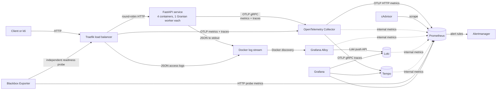

# Docker Observability Learning Stack

Status: design only. No application or infrastructure has been implemented yet.

## 1. Goal

Build a small FastAPI service, run four container replicas with one Granian worker in each, place them behind a load balancer, and observe the system end to end using metrics, logs, traces, dashboards, and alerts.

The whole learning environment will run with Docker Compose. The only host prerequisites will be Docker Engine (or Docker Desktop), the Docker Compose plugin, and enough CPU and memory for the stack. Application dependencies, validation tools, telemetry backends, load generation, and tests will all run in containers.

This is a local learning environment with production-shaped practices. It is not a production deployment of Prometheus, Loki, or Tempo: those services will be single-node and use local Docker volumes.

## 2. Outcomes

At the end of the project we should be able to:

1. Explain the difference between telemetry instrumentation, collection, storage, querying, visualization, and alert delivery.
2. Use the RED method for an HTTP service: request rate, errors, and duration.
3. Correlate a request across a metric, structured log, and trace.
4. Understand horizontal scaling, per-replica state, load balancing, and telemetry aggregation across four application containers.
5. Build useful dashboards, SLIs, recording rules, and symptom-based alerts.
6. Detect a broken telemetry pipeline, not just a broken application.
7. Reproduce the environment with versioned configuration and one Docker Compose command.

## 3. Reference architecture



There are two intentional collection paths:

- Metrics and traces use OpenTelemetry in the application and Traefik and leave through the OpenTelemetry Collector. This keeps backend details out of application code and gives us both edge and application views.
- Logs are structured JSON written to stdout. Alloy discovers the Docker containers, collects their log streams, and sends them to Loki. This follows the container logging model and avoids making application logging depend on a remote backend.

## 4. Full tool stack

| Layer | Tool | Responsibility |
| --- | --- | --- |
| Example service | FastAPI | HTTP API and lifecycle/readiness behavior |
| Process server | Granian | Runs one ASGI worker in each application container |
| Load balancing and ingress | Traefik | Discovers the four healthy Docker replicas, distributes traffic, and emits edge telemetry |
| Instrumentation | OpenTelemetry Python SDK and FastAPI/ASGI instrumentation | Creates server spans, trace context, HTTP metrics, resource metadata, and custom business telemetry |
| Application logs | Python standard logging with a JSON formatter | Emits machine-readable logs to stdout with request and trace correlation fields |
| Telemetry gateway | OpenTelemetry Collector Contrib | Receives OTLP, limits memory, batches, filters unsafe attributes, retries, and exports to backends |
| Metrics store and rule engine | Prometheus | Stores time series, evaluates PromQL recording/alert rules, and scrapes stack health metrics |
| Log collector | Grafana Alloy | Discovers Docker containers, parses JSON logs, applies bounded labels, and forwards logs |
| Log store | Loki | Stores and queries logs with LogQL |
| Trace store | Tempo | Stores and queries distributed traces with TraceQL |
| Visualization | Grafana | Provisioned data sources, dashboards, Explore views, and signal correlation |
| Alert routing | Alertmanager | Groups, deduplicates, silences, inhibits, and routes Prometheus alerts |
| Synthetic availability | Prometheus Blackbox Exporter | Probes the API independently so an outage is measurable even when the API emits no telemetry |
| Container metrics | cAdvisor | Exposes CPU, memory, filesystem, and network metrics for containers |
| Traffic generation | Grafana k6 | Produces controlled normal, slow, concurrent, and failing traffic |

Tools deliberately excluded from the first version:

- Elasticsearch/OpenSearch: Loki is sufficient for this learning goal and keeps the stack smaller.
- Jaeger: Tempo is the trace backend, so a second trace backend would duplicate a role.
- Promtail: Alloy is the current log collector choice.
- Pushgateway: the app is an online service, not a short-lived batch job.
- Kubernetes, Mimir, and object storage: valuable production topics, but they obscure the core telemetry flow.
- Continuous profiling/Pyroscope: this can become an advanced fourth-signal module after metrics, logs, and traces work.

## 5. Example application design

The API will remain intentionally small:

| Route | Purpose |
| --- | --- |
| `GET /` | Normal successful request |
| `GET /work` | Bounded simulated work with manual child spans and custom metrics |
| `GET /slow` | Controlled latency for histogram, trace, and alert exercises |
| `GET /error` | Intentional failure for error telemetry exercises |
| `GET /debug/instance` | Returns the replica identity/hostname and PID for verifying load distribution; local learning only |
| `GET /health/live` | Process liveness; no dependency checks |
| `GET /health/ready` | Readiness; reports whether the replica can serve traffic |

Safety and signal-quality rules:

- Delay and failure inputs will be bounded so the demo cannot accidentally exhaust the machine.
- Health endpoints will be excluded from request logs and application HTTP telemetry to avoid noise.
- Route templates such as `/items/{item_id}`, never raw paths or query strings, will be used as metric dimensions.
- No request body, authorization header, cookie, token, email, user ID, or other sensitive/high-cardinality value will be recorded.
- Exceptions will be captured on spans and in JSON logs, while client-facing responses stay generic.
- A request ID will be accepted or generated and returned to the client. It is searchable log content, not a Prometheus or Loki label.

### Replica and Granian process model

The Compose `api` service runs at a declarative scale of four. Every replica uses the same immutable image and conceptually runs:

```text
granian --interface asgi --host 0.0.0.0 --port 8000 --workers 1 app.main:app
```

The final command will also define graceful shutdown, worker respawn, bounded backpressure, and logging explicitly after those values are tested under load. Resource limits are applied per replica and adjusted from measurements rather than a universal workers-per-CPU formula.

Each replica is a separate failure, scaling, resource, and telemetry unit. It owns one Granian worker with its own Python interpreter, event loop, globals, OpenTelemetry SDK providers, queues, and PID. Therefore:

- Instrumentation initializes once inside each replica.
- Mutable in-memory counters cannot represent service-wide state.
- Metrics from all four replicas export independently and are aggregated by Prometheus queries.
- Resource attributes identify the same service but distinct instances. `service.instance.id` is generated at replica startup; container identity and `process.pid` are diagnostic metadata.
- Replica ID/PID is not added to normal business metric dimensions. It is used only where a per-instance diagnostic view is genuinely useful.
- Shutdown hooks must flush the trace and metric providers within a bounded timeout.
- Stopping one replica must not remove the public endpoint while other healthy replicas remain.

Traefik is the only service that publishes the API port to the host. It discovers replicas using the Docker provider, ignores containers unless explicitly enabled, and routes only to the internal application port. The `api` service must not set `container_name`, because Compose cannot scale a service that has a fixed container name. Compose declares `scale: 4`; the documented CLI may also use `docker compose up --scale api=4` as an explicit override.

Traefik's default weighted round-robin strategy is sufficient because this stateless example needs no session affinity. Traefik emits bounded OTLP metrics and traces to the Collector and JSON access logs to stdout, allowing us to compare edge observations with application observations. Blackbox Exporter probes the route through Traefik, not an individual replica, so availability includes both routing and backend health.

## 6. Telemetry design

### 6.1 Resource identity

Every application signal will consistently carry the OpenTelemetry resource identity:

- `service.name=observability-demo-api`
- `service.namespace=learning`
- `service.version=<build version>`
- `service.instance.id=<unique replica-start UUID>`
- `deployment.environment.name=local`

Build version is supplied during the image build. Environment and service names are configuration, not hard-coded backend-specific fields.

Traefik telemetry uses its own `service.name=observability-demo-edge` and unique instance identity while sharing the namespace and environment. This keeps proxy and application telemetry distinguishable without losing correlation through the propagated trace context.

### 6.2 Metrics

Start with RED and saturation, not dozens of metrics:

- HTTP request count by route template, method, and status code/class.
- HTTP server duration histogram in seconds.
- Current in-flight requests.
- `demo.work` count, duration, and outcome using only bounded attributes.
- Traefik entrypoint/service request count, response codes, duration, and backend health.
- Process/runtime metrics supplied by instrumentation where supported.
- Container CPU, memory, filesystem, and network metrics from cAdvisor.
- Independent API reachability and response timing from Blackbox Exporter.
- Collector/backend ingestion failures, queue usage, dropped items, and scrape health.

Metric rules:

- Counters describe totals, histograms describe latency, and gauges/up-down counters describe current state.
- Units use base units such as seconds and bytes.
- Metric names are stable and documented.
- No user ID, request ID, trace ID, raw URL, exception message, PID churn, or other unbounded value becomes a metric label.
- Histograms are preferred over client-side summaries so percentiles can be aggregated across replicas.
- Known bounded series are initialized where practical so "zero" is not confused with "missing."

The application and Traefik export OTLP to the Collector every 15 seconds for the lab. The Collector exports metrics with stable OTLP/HTTP to Prometheus's native OTLP receiver. Prometheus also uses its normal pull model to scrape the Collector, backends, and cAdvisor. Prometheus will promote only a reviewed set of resource attributes and retain the default suffix-aware metric translation initially.

### 6.3 Traces

Traefik creates the edge span, propagates W3C trace context to the selected replica, and exports through OTLP. Automatic instrumentation creates the FastAPI/ASGI server span as its downstream child. Manual spans inside `/work` demonstrate domain boundaries such as validation, calculation, and persistence simulation. Span names remain low-cardinality and use route/operation names, never IDs.

Local sampling starts at 100% so learning results are deterministic. Production guidance will use parent-based probabilistic head sampling or a deliberately designed Collector tail-sampling tier. Tail sampling is not enabled casually: it requires enough memory and routing all spans of a trace to the same sampling decision point.

Span attributes and events must be useful, bounded, and free of secrets. Error status is set for genuine failed operations, not every HTTP 4xx by default. Batch export is used; console export is available only in an opt-in debug profile.

### 6.4 Logs

Application, Granian, and Traefik access logs go to stdout/stderr as one JSON object per line. Required application fields are:

- timestamp in UTC/RFC 3339
- severity and logger
- event/message
- service name, version, and environment
- request ID when in request context
- trace ID and span ID when a sampled/current span exists
- replica identity and process PID for diagnosis
- exception type and stack trace for server errors

Traefik access logs keep a reviewed field set and the safe request/response correlation header only; arbitrary headers, cookies, and query parameters are dropped. Routine health-probe access events are filtered before Loki ingestion so they do not dominate the learning logs.

Logs must never contain credentials, authorization/cookie headers, full request bodies, or unnecessary personal data. Log volume is controlled by levels and sampling of repetitive success events; errors are never silently sampled away.

Alloy adds only low-cardinality Loki labels such as service, environment, and Compose service. Request ID, trace ID, span ID, raw route parameters, PID, and error messages remain JSON fields/structured metadata, not indexed labels.

Mounting the Docker socket read-only into Alloy and Traefik is a local convenience and still grants sensitive Docker API visibility. Read-only filesystem mode does not make Docker API access harmless. The risk will be documented in the Compose file, access is limited to these two trusted services, and Traefik uses `exposedByDefault=false`. A production design would use a restricted Docker API proxy or the orchestrator/platform-native discovery and log pipelines with least privilege.

### 6.5 Correlation

Grafana provisioning will define:

- Loki derived fields that turn a JSON `trace_id` into a link to Tempo.
- Tempo trace-to-logs queries constrained by service, time range, and trace ID.
- Tempo trace-to-metrics queries for the relevant service/route.
- Prometheus exemplars if the chosen, pinned component versions preserve them end to end; this is an acceptance-tested feature, not an assumption.

The primary investigation workflow will be:

1. Notice an error-rate or latency symptom on the service dashboard.
2. Narrow to route and time window without selecting a high-cardinality dimension.
3. Open a representative exemplar/trace.
4. Follow its trace ID into structured logs.
5. Compare application spans with container saturation and collector health.

## 7. Collector pipelines

The Collector will receive OTLP gRPC and HTTP. The application and Traefik will each use one explicitly configured protocol (gRPC initially). Its configuration will include:

- `memory_limiter` before `batch` to prevent uncontrolled collector memory use.
- `batch` for efficient export.
- resource normalization and an allowlist/filter for sensitive or unwanted attributes.
- OTLP/HTTP exporter to Prometheus for metrics.
- OTLP/gRPC exporter to Tempo for traces.
- retry and bounded sending queues for network exporters.
- `file_storage` on a named volume for queue durability where supported and useful.
- health check and internal telemetry endpoints.
- a debug exporter only in a troubleshooting configuration/profile.

Collector self-observability is part of the design: Prometheus will monitor accepted, refused, dropped, queued, failed, and successfully exported telemetry. A green app dashboard is not trusted if the telemetry gateway is unhealthy.

## 8. Dashboards, SLIs, and alerts

### Provisioned dashboard

One focused service dashboard will contain:

1. Request rate, success/error ratio, and p50/p95/p99 duration.
2. Load-balancer traffic distribution, healthy replica count, and edge-versus-app latency.
3. In-flight requests and per-replica/container CPU and memory.
4. Recent correlated error logs.
5. Recent slow/error traces.
6. Telemetry pipeline health and dropped/export-failure counts.

Dashboards are provisioned from version-controlled files and are read-only by default. They describe likely failure modes rather than displaying every available metric.

### Initial SLIs

- Availability: successful responses at the Traefik edge divided by eligible edge responses, supplemented by Blackbox probe success.
- Latency: proportion of eligible edge requests below the chosen threshold, plus p95 for diagnosis.
- Traffic: eligible requests per second.
- Saturation: in-flight requests, CPU, and memory relative to assigned limits.

Health/debug endpoints are excluded. Exact objectives and windows will be selected from observed lab behavior rather than invented before measurement.

### Initial alerts

- `ApiUnavailable`: externally observable service absence for a sustained interval.
- `ApiHighErrorRate`: user-visible 5xx ratio above a threshold, with a minimum traffic guard and `for` duration.
- `ApiHighLatency`: sustained user-visible latency breach.
- `ApiNearCapacity`: sustained saturation with an actionable capacity response.
- `ApiReplicaCountBelowDesired`: fewer than four healthy backends; a capacity/redundancy warning rather than a page while user traffic remains healthy.
- `TelemetryPipelineDroppingData`: Collector refuses/drops/fails exports or queue approaches capacity.
- `ObservabilityTargetMissing`: expected Collector/backend scrape target disappears.

Alerts are symptom-oriented, include severity, owner, summary, dashboard link, and runbook link, and use `for`/recovery behavior to avoid flapping. Prometheus evaluates rules; Alertmanager owns grouping, inhibition, silencing, and delivery. Local mode exposes Alertmanager for inspection without requiring real credentials. A real notification receiver is added later through Docker secrets or external secret management.

Recording and alert rules will have `promtool` unit tests.

## 9. Docker Compose design

### Services and profiles

Default services:

- `traefik` (the only published API entrypoint)
- `api` (`scale: 4`, one Granian worker in each replica, no published host port and no `container_name`)
- `otel-collector`
- `prometheus`
- `loki`
- `tempo`
- `alloy`
- `grafana`
- `alertmanager`
- `cadvisor`
- `blackbox-exporter`

Optional profiles:

- `load`: k6 one-shot and sustained load scenarios.
- `debug`: verbose Collector output and direct backend UI/API access if extra exposure is useful.
- `profiling` (future): Pyroscope and application profiler.

### Reproducibility and security

- Every image uses a tested explicit version and, where practical, an immutable digest. No `latest` tags.
- Python dependencies are locked and installed in a multi-stage application image.
- The app image runs as a non-root user, has a minimal runtime, and includes a container health check.
- Services use `read_only`, `tmpfs`, dropped capabilities, and `no-new-privileges` where the upstream image supports them.
- cAdvisor host mounts and the Docker socket used by Alloy/Traefik are explicit, documented exceptions.
- Only Traefik's API entrypoint and Grafana need normal host access. The API replicas expose port 8000 only to internal Docker networks. Any backend port exposed for learning binds to `127.0.0.1`, never all interfaces.
- The Traefik dashboard/API is disabled by default; if enabled in the debug profile, it binds only to `127.0.0.1` and is clearly marked local-only.
- Unauthenticated local Tempo, Loki, Prometheus, and Collector receivers stay on an internal Docker network.
- Config files are mounted read-only; writable data uses named volumes.
- No secrets or default production passwords are committed. `.env.example` contains only safe configuration.
- Health checks use each service's supported readiness endpoint. `depends_on` improves startup ordering but never replaces retries/readiness.
- Graceful stop periods allow Granian and the SDK to flush bounded telemetry batches.
- Resource limits prevent a learning backend or load test from consuming the whole workstation.

Persistent named volumes:

- Prometheus TSDB
- Loki data
- Tempo data/WAL
- Grafana state (although dashboards/data sources are provisioned)
- Alertmanager state
- Collector queue storage

`docker compose down` preserves learning data; `docker compose down -v` is the explicit destructive reset and will be documented as such.

### Planned repository layout

```text
.
├── README.md
├── DESIGN.md
├── compose.yaml
├── .env.example
├── app/
│   ├── Dockerfile
│   ├── pyproject.toml
│   ├── uv.lock
│   ├── src/observability_demo/
│   └── tests/
├── observability/
│   ├── traefik/traefik.yaml
│   ├── otel-collector/config.yaml
│   ├── prometheus/prometheus.yaml
│   ├── prometheus/rules/
│   ├── blackbox/config.yaml
│   ├── alertmanager/alertmanager.yaml
│   ├── loki/config.yaml
│   ├── tempo/config.yaml
│   ├── alloy/config.alloy
│   └── grafana/provisioning/
├── load/
│   └── k6/
├── tests/
│   └── smoke/
└── docs/
    └── runbooks/
```

## 10. Implementation and learning sequence

Each step ends with a small experiment and an acceptance check before adding another tool.

### Step 1: Containerized FastAPI/Granian baseline

Create the API, tests, locked dependencies, non-root image, one-worker Granian command, health endpoints, graceful shutdown, four Compose replicas, and Traefik routing/health discovery.

Acceptance: one command builds and starts Traefik plus four healthy API containers; repeated traffic through the single published endpoint reaches all four replica IDs; stopping one replica preserves availability and removes it from routing; unit tests run in Docker.

### Step 2: Structured logging and context

Add JSON stdout logging, request IDs, trace placeholders/context binding, exception handling, redaction tests, compatible Granian logging, and Traefik JSON access logs.

Acceptance: each request produces valid single-line JSON with bounded fields; secrets are absent; errors include useful exception context; there is exactly one edge access record and one application completion record per eligible request rather than duplicates within either layer.

### Step 3: OpenTelemetry traces

Add per-replica SDK initialization, FastAPI instrumentation, Traefik OTLP tracing/context propagation, manual `/work` spans, batch export, Collector, and Tempo.

Acceptance: one request produces a trace covering the Traefik edge and selected application replica; all four replica instance IDs appear over repeated traffic; shutdown does not emit exporter errors.

### Step 4: OpenTelemetry metrics and Prometheus

Add HTTP/custom metrics, Traefik edge/backend metrics, Collector metric pipeline, Prometheus OTLP receiver, backend/internal scrapes, the independent Blackbox HTTP probe through Traefik, recording rules, and rule tests.

Acceptance: RED queries aggregate correctly across four replicas; edge and application views can be compared; label cardinality remains bounded; restarting one replica does not make the service total nonsensical.

### Step 5: Loki and Alloy

Add Docker log discovery, JSON parsing, safe labels, Loki storage, and log retention appropriate for a laptop.

Acceptance: logs from Traefik and every application replica are queryable by service/environment and searchable by request/trace ID without either becoming a Loki label.

### Step 6: Grafana provisioning and correlation

Provision all data sources, the focused dashboard, log-to-trace and trace-to-log links, and tested metric-to-trace correlation where supported.

Acceptance: a generated slow or failed request can be followed from dashboard symptom to trace to exact logs after a clean volume reset.

### Step 7: Infrastructure metrics and load

Add cAdvisor and reproducible k6 scenarios for baseline, concurrency, latency, errors, and a short stress test.

Acceptance: dashboard panels distinguish application latency from CPU/memory saturation, and the test terminates within bounded limits.

### Step 8: SLO thinking and alerting

Define eligible traffic, SLIs, recording rules, initial objectives, alert rules, Alertmanager routing, and short runbooks.

Acceptance: rule unit tests pass; controlled error/slow/unavailable scenarios fire and resolve the intended alert without unrelated noise.

### Step 9: Pipeline failure labs

Temporarily stop Tempo, Loki, and Prometheus one at a time; overload the Collector within safe bounds; stop/restart an API replica; scale the API down and back to four; inspect routing, queues, retries, drops, and recovery.

Acceptance: telemetry failure is visible, the API remains bounded, recovery behavior is understood, and any expected data loss is documented.

### Step 10: Production gap review

Document changes required for a real environment: replace single-host Compose scaling and direct Docker discovery with orchestrator-native replicas, health-aware ingress and rolling deployment; add TLS/authentication, secret management, durable object storage, retention/cost controls, HA, remote notification receivers, backup, capacity planning, and telemetry governance.

## 11. Verification strategy

Every implementation change should use checks appropriate to its layer:

- `docker compose config` for resolved Compose validity.
- Application formatting, linting, type checking, unit tests, and integration tests inside containers.
- Traefik static configuration validation plus a routing test that observes all four healthy backends and excludes a stopped/unhealthy replica.
- Collector configuration validation/startup smoke test.
- `promtool check config`, `promtool check rules`, and rule unit tests.
- Alertmanager configuration validation.
- Loki/Tempo version-specific configuration validation.
- Grafana provisioning smoke test after an empty-volume start.
- End-to-end queries against Prometheus, Loki, and Tempo APIs after generated traffic.
- Cardinality inspection and a no-sensitive-data test.
- Graceful shutdown and backend-outage experiments.

The final stack is accepted only when a new user can clone it, run one documented Docker Compose command, generate traffic, and investigate a deliberately slow/error request without manually configuring Grafana.

## 12. Decisions and caveats

1. **The API is four containers with one Granian worker each.** This follows Granian's container guidance and makes health, resource limits, restarts, and scaling replica-scoped.
2. **OpenTelemetry is the instrumentation contract.** Application code does not import Prometheus, Tempo, Loki, or Grafana clients.
3. **Prometheus receives application metrics via native OTLP.** It still scrapes infrastructure and observability components in the usual way.
4. **Logs use stdout plus Alloy.** This is more robust for container operations than coupling normal application logs to a remote exporter.
5. **Single-node backends are local-only.** Production storage, authentication, tenancy, durability, and HA require a separate design.
6. **Version compatibility is verified during implementation.** Image versions will be pinned together only after configuration and correlation features pass tests.
7. **Four replicas on one Docker host do not provide host-level HA.** They demonstrate replica failure and horizontal routing; real availability requires multiple nodes and an HA ingress/control plane.

## 13. Primary references

- [Granian README and CLI/process guidance](https://github.com/emmett-framework/granian)
- [Docker Compose service scaling](https://docs.docker.com/reference/compose-file/services/#scale)
- [Traefik Docker provider and replica discovery](https://doc.traefik.io/traefik/reference/install-configuration/providers/docker/)
- [Traefik routing services and load balancing](https://doc.traefik.io/traefik/reference/routing-configuration/http/load-balancing/service/)
- [Traefik OpenTelemetry tracing](https://doc.traefik.io/traefik/reference/install-configuration/observability/tracing/)
- [OpenTelemetry Python instrumentation](https://opentelemetry.io/docs/languages/python/instrumentation/)
- [OpenTelemetry Python exporters](https://opentelemetry.io/docs/languages/python/exporters/)
- [OpenTelemetry Collector resiliency](https://opentelemetry.io/docs/collector/resiliency/)
- [Prometheus as an OpenTelemetry backend](https://prometheus.io/docs/guides/opentelemetry/)
- [Prometheus metric and label naming](https://prometheus.io/docs/practices/naming/)
- [Prometheus instrumentation practices](https://prometheus.io/docs/practices/instrumentation/)
- [Prometheus alerting practices](https://prometheus.io/docs/practices/alerting/)
- [Prometheus Blackbox Exporter](https://github.com/prometheus/blackbox_exporter)
- [Grafana Alloy Docker log collection tutorial](https://grafana.com/docs/loki/latest/get-started/quick-start/tutorial/)
- [Loki label best practices](https://grafana.com/docs/loki/latest/get-started/labels/bp-labels/)
- [Tempo local deployment](https://grafana.com/docs/tempo/latest/set-up-for-tracing/setup-tempo/deploy/locally/)
- [Grafana provisioning](https://grafana.com/docs/grafana/latest/administration/provisioning/)
